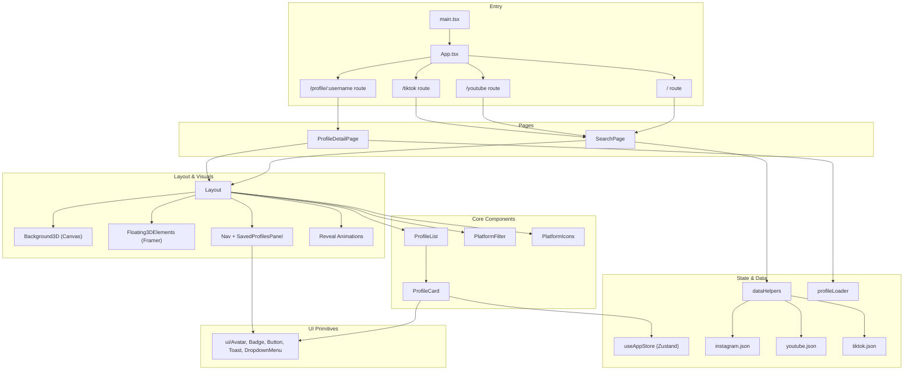

# InfluencerHub

A modern, full-stack influencer search platform built with React, TypeScript, Vite, Zustand, and Tailwind CSS. Features a stunning 3D animated canvas background with immersive UI, persistent profile saving, and cross-platform search across Instagram, YouTube, and TikTok.

## Features

- **3D Canvas Background** — 120+ animated particles, 6 floating orbs with rings, 16 geometric symbols (hexagons, triangles, diamonds, crosses), 60+ floating text elements (emojis, slang, hashtags, multi-language terms), mouse-reactive glow, particle connection lines, twinkling stars, shooting stars, and subtle grid
- **Framer Motion Animations** — Page transitions, staggered card entries, hover/tap interactions, scroll reveals, animated gradient borders, and spring-physics tab indicator
- **Professional SVG Icons** — Lucide React icons (`Camera`, `Play`, `Disc3`, `Star`, `Zap`, `Rocket`, `Crown`, `Heart`, `Diamond`, etc.) replacing all emojis in UI
- **Cross-platform Search** — Filter influencers across Instagram, YouTube, and TikTok
- **Profile Details** — View extended stats, engagement rates, bio with interactive stat cards
- **Save Profiles** — Persistent profile list with smooth animations (Zustand + localStorage)
- **Responsive Design** — Mobile-first with adaptive layouts for all screen sizes
- **Multi-language Background** — Trending terms in English, French, Hindi, Spanish, Portuguese

## Architecture



## Tech Stack

| Layer | Technology |
|-------|-----------|
| Framework | React 19, TypeScript, Vite 8 |
| State | Zustand (persisted to localStorage) |
| Styling | Tailwind CSS v4, CSS Variables |
| 3D Background | HTML5 Canvas API (custom particle system) |
| Animations | Framer Motion |
| Icons | Lucide React |
| UI Components | Radix UI primitives |
| Routing | React Router v6 |
| Build | Vite 8, TypeScript, PostCSS |
| Deployment | Docker + Nginx (Hugging Face Spaces) |

## Getting Started

```bash
# Clone the repository
git clone https://github.com/BugHunterX2101/Wobb_code.git
cd vibe-coder-assignment-main

# Install dependencies
npm install

# Development server
npm run dev
# Open http://localhost:5173

# Production build
npm run build

# Lint
npm run lint
```

## Project Structure

```
src/
├── components/
│   ├── ui/                    # Radix UI primitives (Avatar, Badge, Button, Toast, DropdownMenu, Input)
│   ├── Background3D.tsx       # Canvas-based 3D animated background (particles, orbs, shapes, text)
│   ├── Floating3DElements.tsx # Framer Motion floating SVG icons + emojis
│   ├── Layout.tsx             # Main layout with header, nav, content wrapper, Reveal
│   ├── PlatformFilter.tsx     # Search bar component
│   ├── PlatformIcons.tsx      # Shared SVG platform icons (Camera, Play, Disc3)
│   ├── ProfileCard.tsx        # Influencer card with animations
│   ├── ProfileList.tsx        # Staggered list of profile cards
│   ├── Reveal.tsx             # Scroll/direction reveal animation wrapper
│   ├── SavedProfilesPanel.tsx # Dropdown panel for saved profiles
│   └── VerifiedBadge.tsx      # Verification badge component
├── pages/
│   ├── SearchPage.tsx         # Platform-aware search & browse view
│   └── ProfileDetailPage.tsx  # Detailed profile view with stats
├── store/
│   └── useAppStore.ts         # Zustand store with localStorage persistence
├── utils/
│   ├── dataHelpers.ts         # Platform data loading & filtering
│   ├── formatters.ts          # Number formatting
│   └── profileLoader.ts       # Dynamic profile JSON loading
├── types/
│   └── index.ts               # TypeScript interfaces
├── lib/
│   └── utils.ts               # cn() classname utility, formatters
├── hooks/
│   └── use-toast.ts           # Toast notification system
├── assets/
│   └── data/                  # Profile JSON data (instagram, youtube, tiktok)
├── App.tsx                    # Route definitions with dynamic page titles
├── main.tsx                   # Entry point with BrowserRouter
└── index.css                  # Tailwind imports, CSS variables, animations
```

## What Changed

### 3D Background System
- **Replaced** static CSS emoji animations with a full HTML5 Canvas particle system
- **120+ particles** with mouse repulsion, gravity, damping, and connection lines
- **6 floating orbs** with radial gradients, dual rotating rings, and mouse-reactive glow
- **16 geometric symbols** (hexagons, triangles, diamonds, crosses) with rotation and mouse repulsion
- **60+ floating text elements** rendering emojis, slang, hashtags, and multi-language influencer terms directly on canvas
- **Shooting stars**, twinkling stars, and subtle animated grid lines

### Framer Motion Integration
- **Page transitions** via `AnimatePresence` with fade/slide between routes
- **Staggered card animations** — profiles enter one-by-one with spring easing
- **Hover/tap interactions** — cards scale + glow on hover, buttons pulse on tap
- **Tab indicator** — `layoutId` spring animation for active platform tab
- **Reveal component** — Directional entrance animations (up/down/left/right) with configurable delay
- **Floating 3D elements** — 22 items (mix of SVG icons + emojis) with colored drop-shadows drifting upward

### Icon Overhaul
- Created `PlatformIcons.tsx` — shared component using Lucide React (`Camera` for Instagram, `Play` for YouTube, `Disc3` for TikTok)
- Replaced all emoji icons in UI components: Layout nav, ProfileCard badges, SavedProfilesPanel, SearchPage description, ProfileDetailPage platform badge

### YouTube/TikTok Page Fixes
- Added dedicated routes `/youtube` and `/tiktok` in App.tsx
- `SearchPage` detects platform from `useLocation().pathname` via `routeToPlatform()`
- "Back to search" in ProfileDetailPage now returns to the correct platform page (not always `/`)
- Dynamic `document.title` updates based on current platform

### Immersive Reveal Animations
- Header slides down from top on page mount
- Platform description area reveals with direction="up" animation
- Main content card reveals with direction="up" animation + shimmer gradient border
- Title reveals with direction="left" animation

## Libraries Added

| Package | Purpose |
|---------|---------|
| `framer-motion` | Advanced animations (page transitions, hover effects, stagger, spring physics, layout animations) |
| `lucide-react` | Professional SVG icons (Camera, Play, Disc3, Star, Zap, Rocket, Heart, Diamond, Crown, etc.) |

## Assumptions

1. **Modern browsers** — Canvas API and ES6+ features are required for the particle system and animations
2. **Content creators as audience** — UI prioritizes visual appeal and interactivity over data density
3. **Static data** — Profile data is bundled as JSON (no real-time API); suitable for demo/portfolio
4. **Mobile-first** — Responsive layout optimized for mobile; desktop gets enhanced with more background elements
5. **Dark theme only** — Single color scheme; dark background is essential for the canvas particles to be visible
6. **LocalStorage sufficient** — Saved profiles persist in browser storage (no backend/database)

## Trade-offs

| Decision | Pros | Cons |
|----------|------|------|
| Canvas background vs CSS | Complex 3D particle physics, mouse interaction, connection lines | Heavier CPU usage, harder to debug, no SSR |
| Lucide icons vs emoji | Professional appearance, scalable SVGs, consistent style | Larger bundle (~10KB) vs zero-cost emoji |
| Framer Motion vs CSS animations | Spring physics, layout animations, gesture support, AnimatePresence | ~40KB added to bundle, dependency on React 19 |
| Zustand vs Context | Simple API, built-in persistence, no provider boilerplate | One more dependency, less ecosystem than Redux |
| Bundled JSON data | Zero-latency loading, no API keys needed, works offline | Not real-time, data gets stale, manual updates needed |
| Single HTML5 Canvas layer | All background effects in one render loop, no z-index conflicts | One big useEffect, harder to optimize individual layers |

## Remaining Improvements

### High Priority
- [ ] Code-split framer-motion for smaller initial bundle
- [ ] Add `will-change: transform` to animated elements for GPU acceleration
- [ ] Implement `useReducedMotion` hook for accessibility
- [ ] Add skeleton loading states for profile cards

### Medium Priority
- [ ] Real-time API integration for live follower counts
- [ ] Infinite scroll pagination for large datasets
- [ ] Profile comparison feature (side-by-side stats)
- [ ] Dark/light theme toggle

### Low Priority
- [ ] Web Workers for particle physics offloading
- [ ] Service Worker for offline caching
- [ ] Unit tests for dataHelpers and formatters
- [ ] E2E tests with Playwright

## Live Demo

Deployed on Hugging Face Spaces: https://huggingface.co/spaces/vedit2101/wobb-influencer-search

GitHub: https://github.com/BugHunterX2101/Wobb_code
